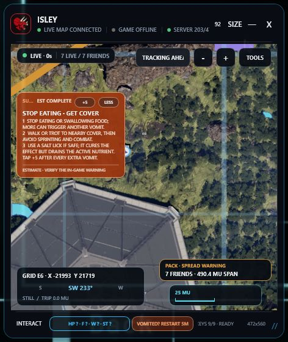
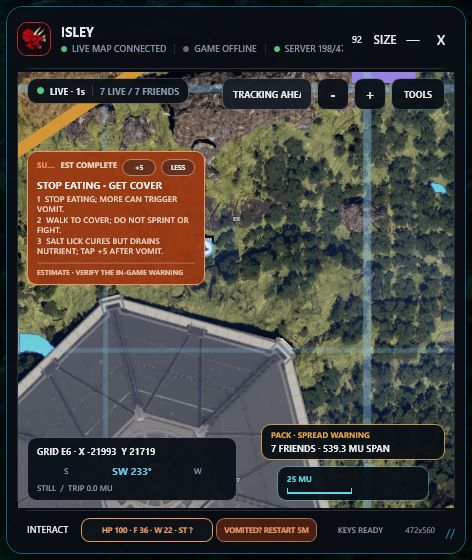
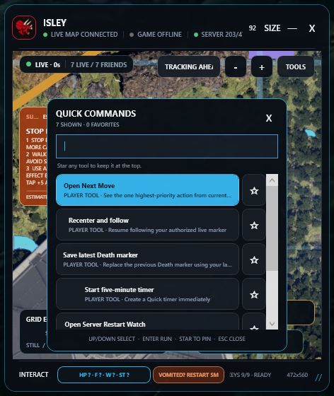
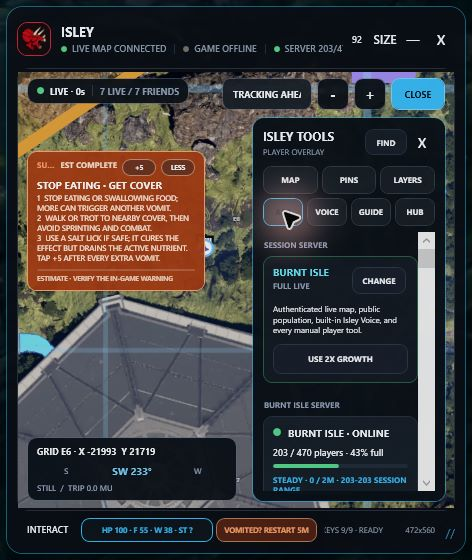
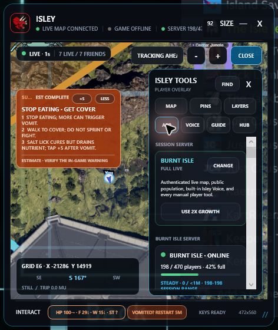
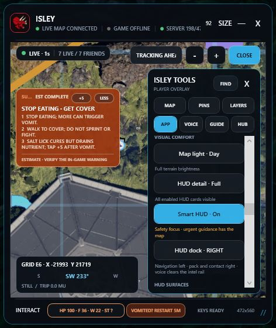
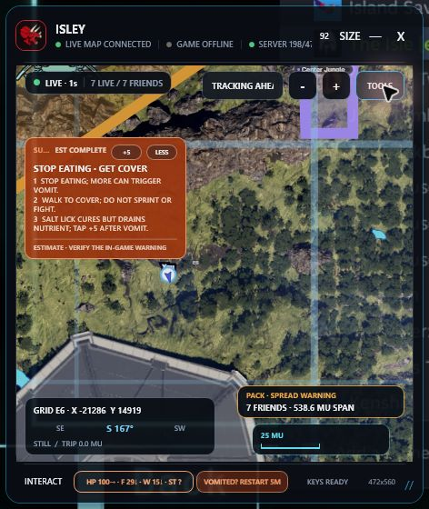

# Isley Live Overlay UX Audit

Date: July 22, 2026
Scope: the running 472 × 560 Isley overlay, compact map, Quick Commands, Tools workspace, and Visual Comfort controls.

## Overall verdict

Isley's compact overlay is cohesive, information-dense without covering the whole game, and keeps its most important controls reachable. The audit found two pressure-use problems: the urgent recovery card was too dense, and a selected Tools tab could lose its label while hovered. Both were corrected and verified in the rebuilt running app.

## 1. Compact map and urgent recovery

Health: corrected

The map keeps live status, tracking, zoom, vitals, recovery, pack spread, heading, and scale in stable zones. The original sickness instructions were too compressed for a player who is moving or under pressure, and the keyboard-status footer was easy to truncate.

Changes:

1. Every supported condition now has exactly three short map instructions.
2. The full explanation remains available in the Survival Assistant.
3. Recovery text is larger and uses a fixed line rhythm.
4. The footer uses the compact `KEYS READY` label and trims safely when space is constrained.

Before:

After:

## 2. Quick Commands

Health: good

Quick Commands already has a strong interaction model: plain-language search, large star targets, clear selected rows, keyboard access, and favorites/recent commands. It does not need another permanent map card. Keeping it behind the existing command surface preserves the overlay's small footprint.

## 3. Tools workspace

Health: corrected

The seven plain-language categories make the large feature set discoverable without exposing everything at once. The audit found that an active tab used dark text on cyan, while the shared hover treatment replaced the cyan surface with dark gray; local color precedence made the label disappear.

The selected state now uses a dedicated deep-blue surface, white text, and a cyan border. It remains distinct and readable at rest and while hovered.

Before:

After:

## 4. Visual Comfort and customization

Health: good

Map lighting, HUD detail, Smart HUD, docking, and surface visibility are grouped together with short explanatory text. The hierarchy supports both a simple default and deep customization without forcing configuration before play.

## Accessibility and evidence limits

- Verified from the live accessibility tree: named buttons, tooltips, focusable Quick Commands, and a named status beacon are exposed to automation.
- Verified from live screenshots: urgent-copy readability, selected-tab hover contrast, stable compact layout, and visible control grouping.
- Verified structurally and behaviorally by the automated suite: resize handling, keyboard commands, pointer-release safety, Smart HUD surfaces, and responsive footer treatment.
- Screenshot review alone cannot certify full WCAG compliance, every Windows scaling factor, screen-reader announcements, or all arbitrary resize combinations. Those require dedicated assistive-technology and multi-display testing.

## Final running state

